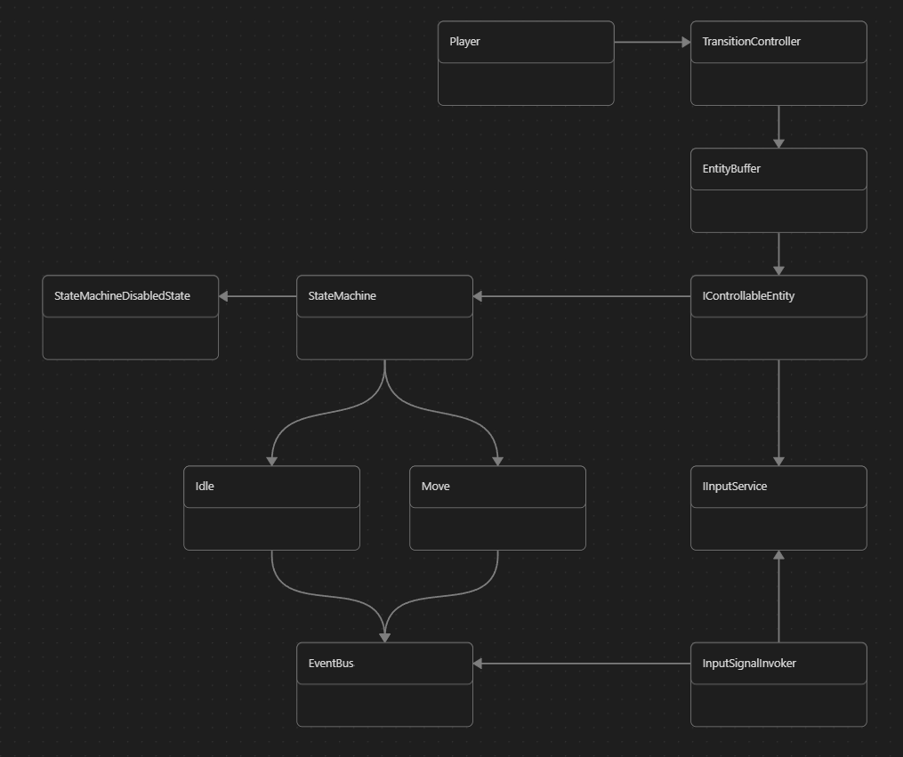

## Cosmo pixel game (in development).
This is my project which is intended to be a brief display of my skill in code.
### The main core mechanic 
The main core mechanic is transformation in different entities. It is an interesting task from the point of view code.

###How it is works?
There is a global, ghostly Player entity. This is like a player moving between entities when switching. We just enable or disable some components in an entity (instance InputSignalInvoker).
Player has an EntityBuffer where all nearby entities are stored. Each entity has a **StateMachine**, and states have an input **event bus** that fires input events.

